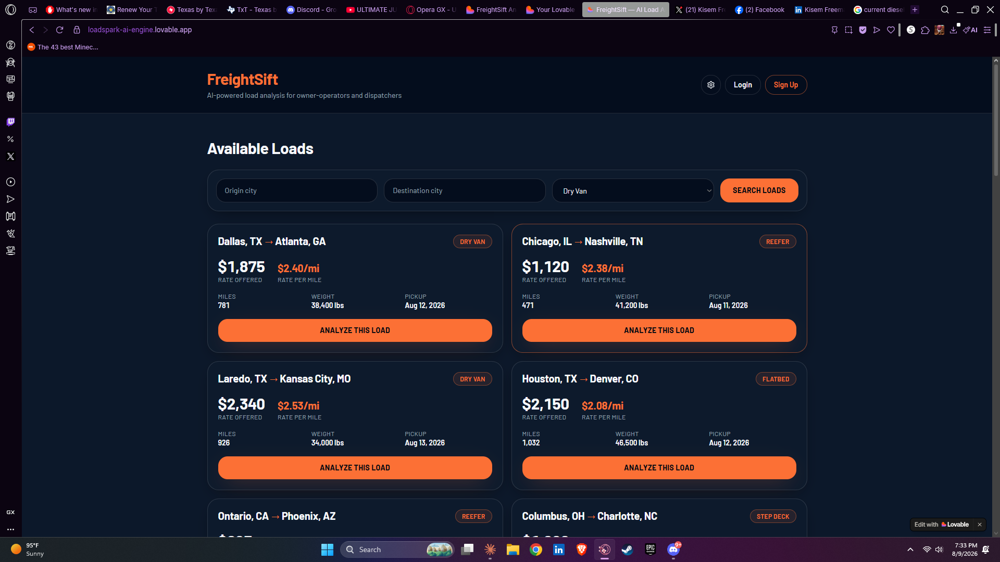
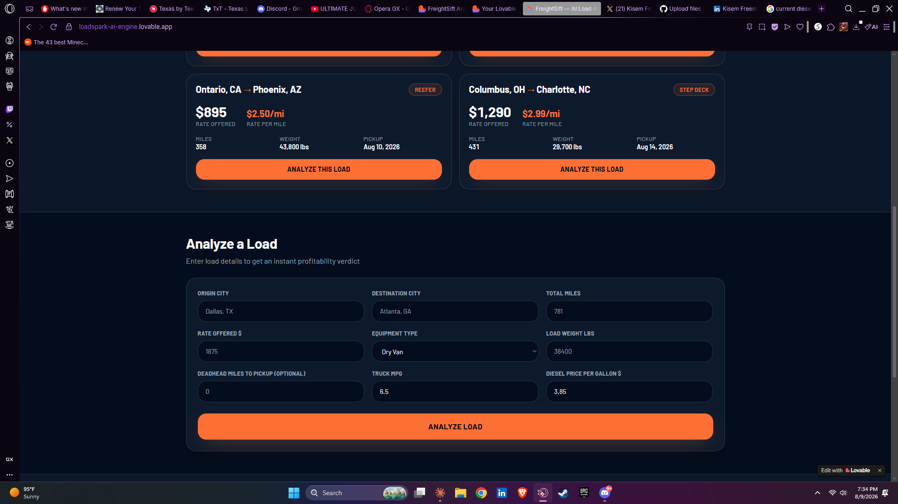
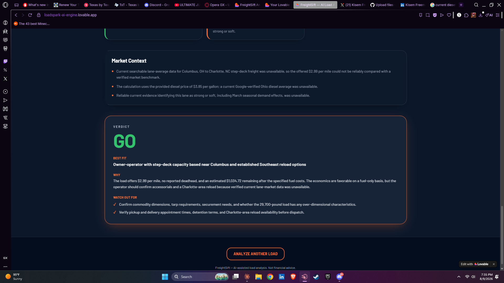
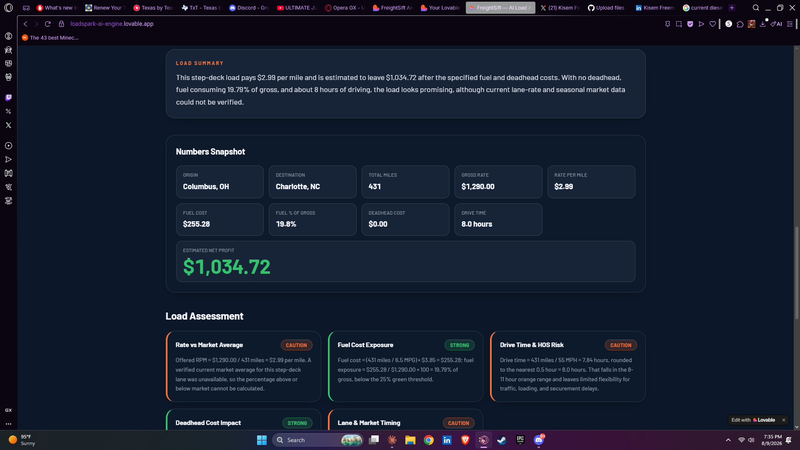

# FreightSift

> AI-powered load analyzer for owner-operators and dispatchers — enter a load, 
> get instant profitability flags, market rate comparison, and a GO/NO-GO verdict.


**🔗 [Live Demo](https://loadspark-ai-engine.lovable.app)**

---

## Screenshots

### Load Browser


### Analyzer Form


### GO/NO-GO Verdict




---

## What It Does

FreightSift helps truck drivers and dispatchers make faster, smarter load 
decisions. Browse available loads on common US lanes, click one to auto-fill 
the analyzer, and get an instant AI-powered profitability breakdown in seconds.

No more guessing if a load is worth taking. FreightSift runs the numbers and 
tells you straight.

---

## Core Features

- **Load Browser** — browse mock loads across common US lanes filtered by 
  origin, destination, and equipment type (Dry Van, Reefer, Flatbed, Step Deck)
- **One-click Auto-fill** — click "Analyze This Load" on any card to instantly 
  populate the analyzer form
- **AI Rate Analyzer** — enter any load's details and get a full profitability 
  breakdown powered by Google Gemini with live market data
- **5-Flag Assessment** — color-coded risk scoring across five key categories
- **GO / NO-GO Verdict** — clear call with reasoning, best-fit operator type, 
  negotiation tip, and a diligence checklist
- **Saved Analysis History** — logged-in users can save and revisit past analyses

---

## The 5-Flag Profitability Engine

Every load is scored across five categories:

| Flag | What It Checks |
|---|---|
| 🟢/🟠/🔴 Rate vs Market Average | Load RPM vs current lane market rate |
| 🟢/🟠/🔴 Fuel Cost Exposure | Fuel as % of gross — flags if over 25-35% |
| 🟢/🟠/🔴 Drive Time & HOS Risk | Miles at 55mph avg — flags HOS compliance risk |
| 🟢/🟠/🔴 Deadhead Cost Impact | Deadhead miles as % of gross rate |
| 🟢/🟠/🔴 Lane & Market Timing | Current lane strength and seasonal demand factors |

Each flag returns **Strong** (green), **Caution** (orange), or **Pass On It** (red).

---

## Numbers the AI Calculates

Given your inputs, FreightSift computes:

- **Fuel Cost** — (miles / MPG) × diesel price
- **Deadhead Cost** — (deadhead miles / MPG) × diesel price
- **Rate Per Mile** — gross rate / total miles
- **Fuel Cost %** — fuel cost as a percentage of gross
- **Estimated Net Profit** — gross rate minus all costs
- **Drive Time** — total miles / 55mph average

---

## Tech Stack

| Layer | Technology |
|---|---|
| Frontend | React + TanStack Router, Tailwind CSS |
| AI Model | Google Gemini with Search Grounding |
| Backend | Supabase Edge Functions (Deno) |
| Auth & Database | Supabase (email/password, row-level security) |
| Hosting | Lovable |

---

## How It Works

```
User browses loads or enters custom load details
              ↓
Form validated — defaults applied (MPG 6.5, diesel $3.85)
              ↓
Load details sent to Supabase Edge Function
              ↓
Edge Function calls Google Gemini with Search Grounding
              ↓
Gemini calculates numbers + queries live lane market data
              ↓
Returns structured JSON (numbers, 5 flags, verdict)
              ↓
React UI maps JSON to result cards with fade-in animation
              ↓
Analysis saved to Supabase (if user is logged in)
```

---

## Sample Loads Included

FreightSift ships with 6 realistic mock loads on common US lanes:

| Lane | Equipment | Rate | RPM |
|---|---|---|---|
| Dallas, TX → Atlanta, GA | Dry Van | $1,875 | $2.40/mi |
| Chicago, IL → Nashville, TN | Reefer | $1,120 | $2.38/mi |
| Laredo, TX → Kansas City, MO | Dry Van | $2,340 | $2.53/mi |
| Houston, TX → Denver, CO | Flatbed | $2,150 | $2.08/mi |
| Ontario, CA → Phoenix, AZ | Reefer | $895 | $2.50/mi |
| Columbus, OH → Charlotte, NC | Step Deck | $1,290 | $2.99/mi |

---

## Built By

**Kisem R. Freeman**
- 📧 kisemrf@gmail.com
- 💼 [linkedin.com/in/kisem-freeman-198159101](https://linkedin.com/in/kisem-freeman-198159101)
- 🔗 [github.com/kidsidy](https://github.com/kidsidy)

---

## Related Projects

- [DealSift](https://github.com/kidsidy/DealSift) — AI deal screening for 
  multifamily commercial real estate

---

*FreightSift — AI-assisted load analysis. Not financial advice.*
